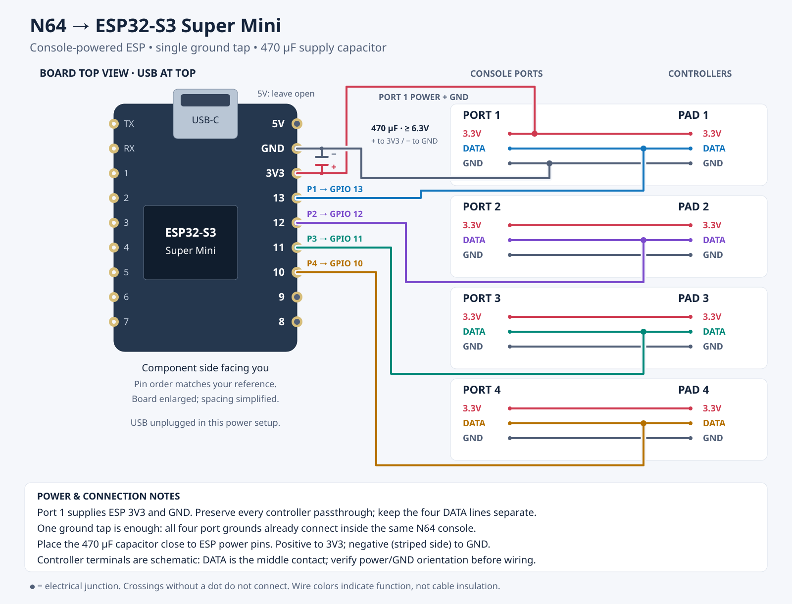

# NintendoSpy N64 reader — ESP32

A PlatformIO/Arduino port of NintendoSpy's N64 input reading, scoped only to the Nintendo 64's
single-wire controller protocol. The ESP32 passively sniffs up to 4 controller DATA lines and prints
the decoded input over serial — it never drives the line.

Ported from the project's AVR firmware ([../firmware/firmware.ino](../firmware/firmware.ino),
`loop_N64`) and the packet layout in [../Readers/Nintendo64.cs](../Readers/Nintendo64.cs).

## How it works

The N64 controller talks over one idle-high open-collector wire. Each bit is a ~4µs pulse:

| Bit | Low  | High |
|-----|------|------|
| `0` | ~3µs | ~1µs |
| `1` | ~1µs | ~3µs |

So after each falling edge, sampling the line ~2µs later reads the bit: a `1` has already returned
high, a `0` is still held low. Each polled frame is the console's 9-bit prefix (`0x01` poll command
`0000_0001` + a `1` stop bit) followed by the controller's 32-bit response.

The AVR-specific bits were replaced for the ESP32: `PIND` reads → direct `GPIO.in` register reads,
hand-counted NOP delays → the Xtensa cycle counter (`xthal_get_ccount`) scaled by `F_CPU`.

## Wiring

> [!WARNING]
> **Do not connect USB-C while the adapter is connected to the N64 console.**
> Fully disconnect the adapter from **all four console ports** before connecting USB-C to a computer or USB power source. Disconnect USB-C before reconnecting the adapter to the console.
>
> **Turning the console off is not enough.** USB power can backfeed the console’s 3.3V rail and potentially damage hardware. The 470 µF capacitor does not prevent backfeeding.



[Download the wiring graphic (SVG)](docs/n64-esp32-wiring.svg). The diagram uses
the board’s component-side view with USB at the top, matching the supplied
Super Mini pinout. The right-edge pins run **5V, GND, 3V3, GPIO 13, 12, 11, 10,
9, 8** from top to bottom; 3V3 is labelled `3V3OUT` in the reference image.
Board spacing is simplified, and controller terminals are schematic. Power the ESP by
tapping one console controller port’s 3.3V rail into the ESP **3V3** pin (port 1
is shown). Tap **GND from that same port** to ESP GND. One ground tap is enough:
all four port grounds are already common inside the same N64 console. Preserve
each controller’s power and ground passthrough; no extra ground bridges between
ports are needed. Connect a
**470 µF electrolytic capacitor** across ESP 3V3 and GND, close to the board with
short leads: **positive (+) to 3V3**, **negative (striped side) to GND**. Use a
voltage rating of at least 6.3V. The 470 µF value is the reported value from the
earlier power tests. Leave USB unplugged and the ESP 5V pin unconnected in this
console-powered arrangement.

The Super Mini's onboard RGB LED defaults to solid red while powered. This can be
disabled with the controller command below; the preference survives reboots. Its GPIO is
configured with `POWER_LED_PIN=48` in `platformio.ini` for all S3 environments.
The generic `esp32dev` environments leave the LED disabled unless that flag is set.

| N64 connector | ESP32 |
|---------------|-------|
| GND (same port as power tap) | GND |
| DATA (middle) | GPIO 13/12/11/10 (`N64_PIN_1..N64_PIN_4` in [src/main.cpp](src/main.cpp)) |
| 3.3V (tap one console port) | 3V3, with 470 µF capacitor to GND |

The N64 data line is 3.3V logic with a pull-up on the console side, so it connects directly to an
ESP32 input — no level shifting needed. **Share a common ground** with the console/controller.

To sniff a live console↔controller session, tap the DATA line between them (e.g. with a passthrough
adapter). The console must be polling the controller for frames to appear.

If your data wires are on different GPIOs, change `N64_PIN_1..N64_PIN_4` in [src/main.cpp](src/main.cpp).

## Live web UI (wireless)

The ESP32 also serves a small web page that mirrors the controller state in real time, so
you don't need a wired serial connection to watch input.

No WiFi credentials are hardcoded — they're configured once via a captive portal:

While the setup portal is open, the LED flashes **red (500 ms on / 500 ms off)**
to show that WiFi setup is needed, even if the normal power LED is disabled.
Resetting WiFi returns to this flashing state after reboot. Controller commands
become available once WiFi setup completes.

1. On first boot the ESP32 brings up an open WiFi network named **`N64Spy-Setup`**. Join it from a
   phone/laptop; a captive-portal config page pops up automatically. Pick your network, enter the
   password, and save. The credentials are stored in flash, and the ESP32 reconnects to your
   network automatically on every later boot.
2. Open the serial monitor — it prints the IP it got (and `http://n64spy.local/` via mDNS).
3. Open that address in a browser. The page connects to a WebSocket at `/ws`; the firmware pushes
   a 5-byte binary frame (`controllerIndex + 4-byte state`) on every state change, and the page
   lights up the buttons / moves the stick for the active controller.

To move the device to a different network, hold the **BOOT** button (`WIFI_RESET_PIN`, GPIO 0 on
most dev boards) for ~3 seconds — either at power-up or any time during normal operation. That
forgets the saved network and reboots into the setup portal.

### Controller commands

Press **L + R + D-pad down** together on any controller to enter command mode.
The LED turns **green** for up to **5 seconds**. During that window, press a command
button on the **same controller** (you can release the entry combination first):

| Button | Action |
|--------|--------|
| **START** | Forget saved WiFi and reboot into the **N64Spy-Setup** captive network. |
| **Z** | Toggle the normal red power LED on/off and save the preference. |

A recognised command ends listening immediately. The LED flashes **magenta three
times**, each with **500 ms on and 500 ms off**, then performs the action. Command
feedback still lights up when the red power LED is disabled. Capture and web updates
continue during the confirmation flashes.

Buttons already held when entering command mode must be released and pressed again.
Other buttons (and simultaneous START + Z presses) are ignored until a single command
is pressed or the window expires. A timeout restores the normal LED setting.
Release and press the entry combination again to start another command window.
The console must be running and polling the controller, and commands are available
after startup WiFi setup completes. As a passive sniffer, these presses also reach
the game.

The async server runs in its own task (on the other core), so it never disturbs the timing-critical
bit-bang sniff. The setup portal runs only during startup, before that server begins, so the two
never clash over port 80.

The state wire format (see `packState()` in [src/main.cpp](src/main.cpp) and the bit masks in
[include/web_ui.h](include/web_ui.h)):

| Byte | Bits (MSB→LSB) |
|------|----------------|
| 0    | controller index (0..3) |
| 1    | A, B, Z, START, UP, DOWN, LEFT, RIGHT |
| 2    | –, –, L, R, C-UP, C-DOWN, C-LEFT, C-RIGHT |
| 3    | stick X (int8) |
| 4    | stick Y (int8) |

## Build, upload, monitor

**Before plugging in USB-C, disconnect the adapter from all four console ports—even if the console is switched off.**

```sh
pio run                 # build
pio run -t upload       # flash
pio device monitor      # serial @ 115200
```

## Output

State is logged on change to keep the serial output readable:

```
[N64 1] A START stick=(0, 0)
[N64 3] UP stick=(-42, 118)
```

Unrecognized frames (commands other than the controller-state poll, e.g. rumble/mempak) are ignored.
