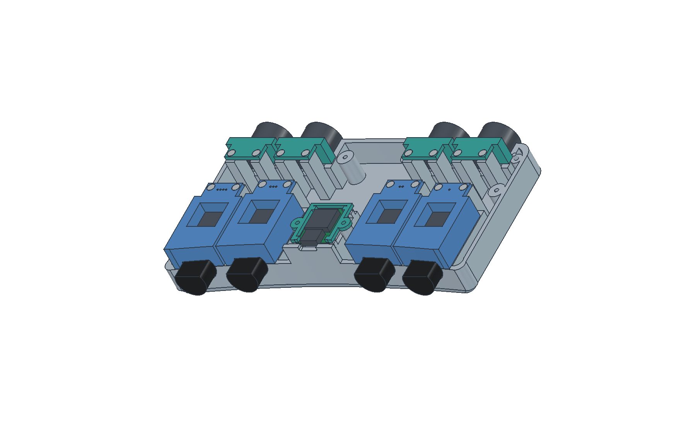
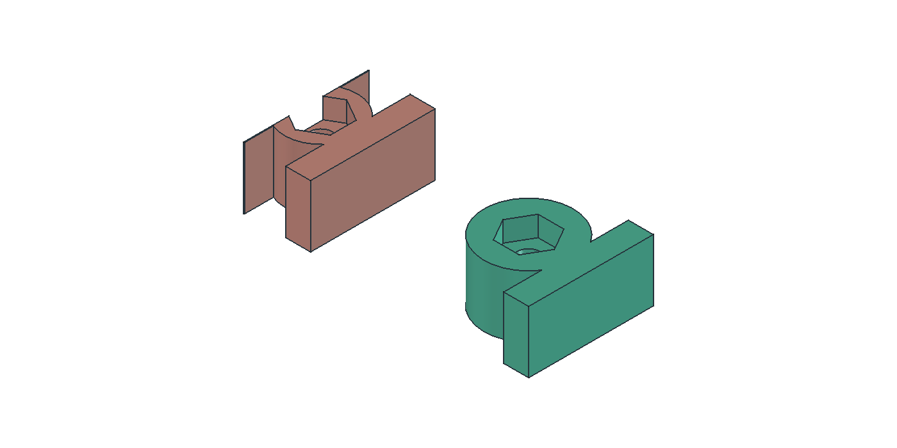
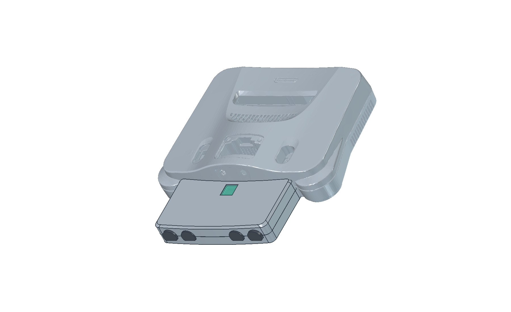

# N64InputMod v0.15 — complete closure nut seats

Open [N64InputMod-v0.15.FCStd](N64InputMod-v0.15.FCStd), or the identical current [N64InputMod.FCStd](N64InputMod.FCStd). This revision fixes keeper-clearance cuts that clipped the v0.14 closure nut bosses. All six closure fasteners move into clear locations, with complete hex seats and at least 1.5 mm of surrounding wall verified in CAD. Both shells must be reprinted; the port keepers, PCB keeper and window are unchanged.

The enclosure is 18 mm deeper toward the console and surrounds almost the entire male housing. Each port has its own keeper attached to the lower shell, so removing the lid leaves the connectors secured.

- Male housings are captured by their contours, rear shoulders and front retaining lips. No screws enter the connector plastic; no soft pads, pressure shoes or M3 clamp hardware are used.
- Female keepers capture the existing flanges. All four female keepers are identical.
- The four male keepers have port-specific curved ends and one through four shallow identification dimples. Their screws are behind the connector housings, accessible with the lid off.
- All eight connector housings retain v0.13's X/Y/Z positions. Male X centres remain −64.04, −36.00, +36.00, +64.04 mm.
- The ESP cradle, keeper, USB opening and LED window move 18 mm toward the console together. Their shapes are unchanged; existing board-keeper and window prints can be reused.

The lower shell is still the structural base. This design allows independent lid removal; removing the lower shell from the internals requires releasing the keepers.

## Print and assemble

Use the [v0.15 print package](N64InputMod-full-enclosure-v0.15.zip) and its [assembly instructions](print/full-enclosure-v0.15/PRINT-AND-ASSEMBLE.md). Reprint both shells, four male keepers and four female keepers. The STL package contains 12 physical parts including the reusable PCB keeper and optional window; files are bed-oriented at 100% scale.

Eight port keepers use sixteen 2 mm nominal × 8 mm countersunk screws suitable for plastic, in 1.6 mm printed pilot holes. Six M2 × 20 machine screws and six embedded M2 nuts still close the case; the two original normal M2 × 8 plastic screws retain the PCB. See the assembly instructions for head geometry, pilot-hole compatibility and sequencing.

Only the six M2 closure nuts remain embedded in the lid. Remove the old M3-nut pause. At the original roof-down 0.16 mm layer / 0.20 mm first-layer profile, the M2 pause target remains before layer 88 (Z=14.12 mm), subject to checking the new slice. The [print-ready v0.15 Orca 3MF](N64InputMod-full-enclosure-v0.15-Orca-complete.3mf) contains all three sliced plates using the existing Bambu Lab P1S 0.4 mm profile. Plate 1 contains both shells (PLA), plate 2 the eight port keepers and PCB keeper (PLA), and plate 3 the optional window (PETG). The saved Supertack bed setting is retained. All three plates sliced without reported plate warnings. A single native M400 U1 pause on plate 1 occurs before layer 88 at Z=14.12 mm; toolpath checks confirm all six nut-pocket caps start after it. Plates 2 and 3 have no pauses. See `orca-v0.15-validation.json` and `pause-v0.15-toolpath-validation.json`.

## Extended male reference

The source [male connector STEP](../n64-input-ControllerPortMale.step) now includes the user-measured black mating projection: 16 mm circular diameter, flattened to 12 mm high, extending 12 mm from the housing. A [versioned copy](../n64-input-ControllerPortMale-v0.14.step) is supplied. The [original housing-only model](../n64-input-ControllerPortMale-housing.step) is preserved and remains the build datum, so adding the projection does not move the housing.

The projection is modelled concentric with the housing, flat side up, matching the housing's flat side. The opening uses 0.35 mm clearance per axis around that envelope. Contacts, recesses, moulding tolerances and internal construction are not modelled. Approximately 10 mm of the 12 mm projection remains beyond the local case face; actual full insertion must be checked.

## Validation and scope

- `nut-seats-v0.15-validation.json`: complete walls, bearing surfaces and caps at all six pockets, insertion of a nominal M2 nut at the pause, clear screw paths, and unchanged keepers.
- `validation.json`: valid connected print solids and no unintended assembled intersections with housings, mating projections or board envelopes.
- `independent-retention-validation.json`: housing positions unchanged, board assembly translated only, both male/female housings blocked against lift and movement in either axial direction, keeper screw clearance, vertical lid removal and USB access.
- `console-retention-fit.json`: full-resolution Top/Bottom scan triangle intersection checks against both shells and the complete male connector envelopes. Whole triangles are cropped only to the assembly's surrounding region, without decimation.
- `mesh-validation.json`: STL closure after welding coincident vertices at 0.0001 mm.
- `print/full-enclosure-v0.15/manifest.json`: quantities, bed orientation, dimensions and file hashes.

The scan overlay is recentered in X using the existing scan-spacing measurements and shifted +12 mm in Y to account for the formerly omitted mating projection. This preserves the historical intended tip engagement; it is an explicit assembly-registration assumption, not a new measurement of installed socket/contact depth. The original Z registration is retained. Zero surface intersections under this registration do not certify electrical mating depth, printing accuracy or load strength. Physical v0.15 fit remains unverified.

Previews use reduced meshes for display; the scan check uses the original roughly 120 MB STL files. Reference: [Wesk's N64 console scan](https://bitbuilt.net/forums/threads/n64-console-scan.5527/).

## Regeneration and history

Edit `parameters.json` and run `build.FCMacro` in FreeCAD. Keep the two housing STEP references in the parent folder. `build.py` creates named BRep features rather than a constrained sketch history; editing the FCStd parameter snapshot alone does not recompute the geometry. `retention_previews.FCMacro` sets presentation visibility and regenerates the previews.

v0.14 source, CAD and validation are preserved in `revisions/v0.14/`; its clipped nut pockets are superseded by this version. v0.13 is also retained in `revisions/v0.13/`; its versioned CAD and print ZIP remain historical. Prior README sections and older assembly procedures are available in those revision snapshots. Obsolete clamp pads/shoes and old fit gauges are not part of the v0.15 print package.

## Existing electrical precaution

Fully disconnect the adapter from all four console ports before connecting USB-C. Disconnect USB-C before reconnecting the adapter to the console. Turning the console off alone is insufficient: USB power can backfeed the console's 3.3 V rail. The rear-facing USB position is not an electrical interlock.

Wiring and firmware are documented in [repository README](../../README.md). CAD iterations now live alongside the firmware in this repository.
